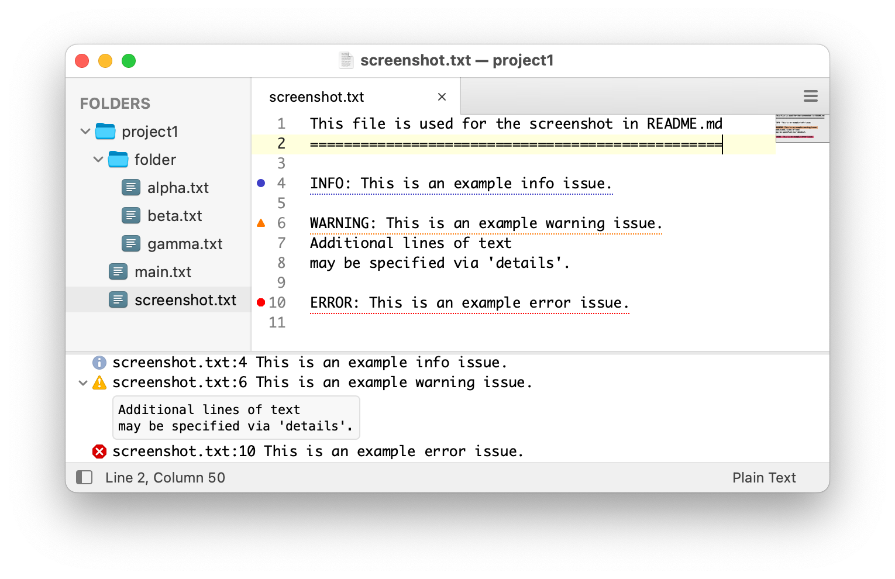

# BuildSock

Receives build results over a local socket and presents them in Sublime Text.

## Why?

[My company](https://www.musictheory.net/) uses a continuously-running build server to monitor changes to local files and initiate compilation tasks. This build server runs separately from text editors, automation shell scripts, and IDEs.

Sublime Text has basic support for [build systems](https://www.sublimetext.com/docs/build_systems.html); however, these are designed to *initiate* the build process. In my case, Sublime Text needs to be "just another listener" of the build server's progress.

Also, the output of the built-in build systems is limited – results are typically displayed as plain text. Ideally, I want issues displayed as fancy table rows with disclosure controls, icons, and tooltips.

BuildSock solves these problems.

## Design



## Usage

Sending results to BuildSock is simple:

1. Connect to the local socket. The default path is `/tmp/sublime.buildsock.sock`
2. Write a JSON-formatted string in UTF-8 encoding
3. Send the FIN packet

For example, to show a failure message and list of issues, one might write the following JSON:

```
{
    "project": "/Users/me/Projects/Foo",
    "commands": [
        {
            "command": "show-status",
            "message": "Build failure"
        },
        {
            "command": "show-issues",
            "issues": [
                {
                    message: "'Foo' is invalid",
                    file: "folder/file.js",
                    line: 42
                }
            ]
        }
    ]
}
```

The following TypeScript definitions describe the JSON protocol. `Message` corresponds to the root object.

```typescript
enum IssueType {
    "generic", // no icon
    "info",    // bluish circle with "i"
    "error",   // red octagon with "X"
    "warning"  // yellow triangle with "!"
}

enum SpinnerSet {
    "clock", // Uses the clock emoji
    "dot1",  // 1 dot moving in a square pattern
    "dot2",  // 2 dots moving in a square pattern
    "dot3"   // 3 dots moving in a square pattern
}

interface Message {
    project: string,
    commands: Command[]
}

interface Command {
    command: string
}

interface ShowIssuesCommand extends Command {
    command: "show-issues",
    issues: Issue[]
}

interface HideIssuesCommand extends Command {
    command: "hide-issues"
}

interface ShowStatusCommand extends Command {
    command: "show-status",

    // The message to display
    message?: string,

    // An animated icon next to the message.
    // Will cause the message to display indefinitely.
    spinner?: SpinnerSet | string[]
}

interface HideStatusCommand extends Command {
    command: "hide-status",
}

interface ClearCommand extends Command {
    command: "clear"
}

interface Issue {
    // The type of the issue. If missing, defaults to "generic".
    type?: IssueType,

    message?: string,    // Message to display
    file?:    string,    // Path, relative to project path
    line?:    number,    // Line number of the issue
    column?:  number,    // Column number of the issue

    // If set, adds a disclosure indicator next to the issue.
    // The details string appears under the issue when the
    // disclosure is clicked.
    details?: string, 

    // If set, hovering over the disclosure/issue icon will
    // display a tooltip with this string.
    tooltip?: string
}
```

## Settings

BuildSock settings can be customized with a `Packages/User/BuildSock.sublime-settings` file.

The default settings are:

```javascript
{
    // The path of the local socket
    "socket_path": "/tmp/sublime.buildsock.sock"

    // Used to control gutter icon vertical position
    // Valid values are: "lowest", "lower", "normal", "higher", or "highest"
    "gutter_icon_adjust": "normal",
    
    // Used to tweak issue icon vertical position
    "issue_icon_adjust": 0,

    // Set to a string to use a custom font face for issue 'details'
    "details_font_face": null,
    
    // Set to a number to use a custom font size for issue 'details'
    "details_font_size": null,

    // If true, the issues panel uses a custom syntax scheme to assign scopes
    // If false, the issues panel uses the default "Plain Text" syntax
    "colorize_issue_panel": false,

    // Used to customize the scope of gutter icons and region underlines
    "generic_issue_scope": "region.redish",
    "info_issue_scope":    "region.bluish",
    "warning_issue_scope": "region.orangish",
    "error_issue_scope":   "region.redish",
    
    // Additional settings to apply to the issue output panel
    "issue_panel_settings": { }
}
```


## Colorized Issue Panel

By default, BuildSock will use the "Plain Text" syntax for the issue panel.
This displays all text with the foreground color.

Colorization of the panel is possible by setting `colorize_issue_panel` to `true`:


Your active color scheme will need to use the following scopes:

```text
output.buildsock
meta.header.buildsock
meta.header.colon-line-number.buildsock
meta.header.colon-line-number.buildsock
entity.name.folder.buildsock
entity.name.filename.buildsock
constant.numeric.line-number.buildsock
constant.numeric.column-number.buildsock
```

By default, BuildSock will use the same color scheme as the rest of Sublime Text.
You can specify a custom color scheme via the `issue_panel_settings` setting:

```json
{
    "colorize_issue_panel": true,
    "issue_panel_settings": {
        "color_scheme": "Packages/Users/ExampleColorScheme.color_scheme"
    }
}
```

## Example Build System

Open `example/project1` in Sublime Text and then run `node example/example.js`.


## License and Acknowledgements

I only care about proper attribution in source code. While attribution in binary form is welcomed, it is not necessary.

Hence, unless otherwise noted, all files in this project are licensed under both the MIT License OR the 1-clause BSD License. You may choose either license.

`SPDX-License-Identifier: MIT OR BSD-1-Clause`
